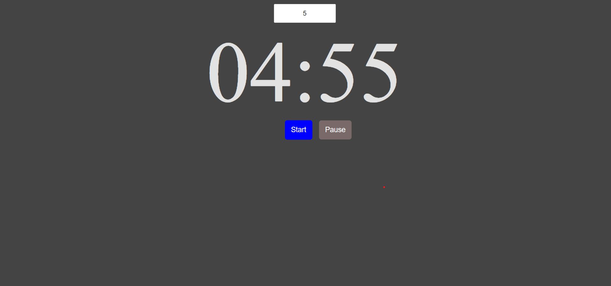

# **COUNTDOWN**

Its a timer app where user can input some value and time get starts when we click on the start button. From that particular value the time decreases. We can stop the time as well as restart the time from that particular point.

## Images

## Trainer Target

- Implementation of DOM
- Countdown timer
- Logic Implementation
- function implementation

## Trainee Achieved

- knowledge of implementation of DOM
- Learn countdown timer concept
- Learn javascript functionalities

## Tech stack

### _Language_ : HTML, CSS, Javascript
